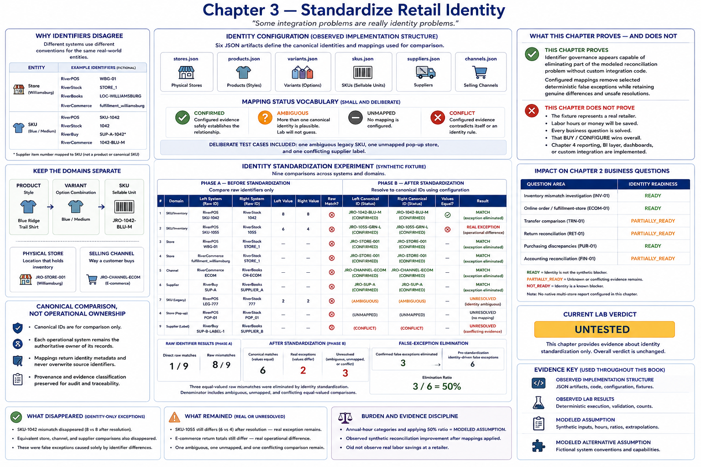

# Chapter 3 — Standardize Retail Identity



> Some integration problems are really identity problems.

This chapter makes the lab's first configured change. It asks how much apparent
reconciliation burden disappears when fictional James River Outfitters gives the
identities already owned by its operational systems a common comparison convention.
It does **not** create a system of record, integration service, or MDM platform.

## Why identifiers disagree

Systems choose identifiers for their own purposes. RiverPOS calls Williamsburg
`WBG-01`; RiverStock calls it `STORE_1`; RiverBooks uses `LOC-WILLIAMSBURG`; and
RiverCommerce records `fulfillment_williamsburg`. These are fictional platform
conventions (**MODELED ALTERNATIVE ASSUMPTION**), not defects in real products.
Different strings can denote one entity, while similar strings can denote different
concepts. Comparing their characters therefore creates false exceptions.

## Keep the domains separate

The configuration explicitly models:

```text
PRODUCT: Blue Ridge Trail Shirt
        ↓
VARIANT: Blue / Medium
        ↓
SKU: JRO-1042-BLU-M
```

A product is a style, a variant is an option combination, and a SKU is the sellable
stock unit. RiverBuy's `SUP-A-1042` is a **supplier item number mapped to a SKU**;
it does not become a product or canonical SKU merely because it participates in a
crosswalk. Similarly, `JRO-STORE-001` is a physical store and
`JRO-CHANNEL-ECOM` is a selling channel. Williamsburg may fulfill a web order
without becoming the web channel.

## Canonical comparison, not operational ownership

The six JSON artifacts under `config/identity/` define stores, products, variants,
SKUs, suppliers, and channels. They are **OBSERVED IMPLEMENTATION STRUCTURE**.
Canonical IDs are lab conventions for comparison. RiverPOS, RiverStock,
RiverCommerce, RiverBuy, RiverBooks, and the source spreadsheet remain authoritative
for their records.

Every mapping retains identity type, source system, original source identifier,
status, provenance, and evidence classification. Resolution returns those fields
rather than overwriting the source identifier, so an investigator can trace a result.
The status vocabulary is deliberately small:

- `CONFIRMED`: configured evidence safely establishes the relationship.
- `AMBIGUOUS`: more than one canonical identity is plausible; the lab will not guess.
- `UNMAPPED`: no mapping is configured.
- `CONFLICT`: configured evidence contradicts itself or an identity rule.

The deliberate ambiguous legacy SKU, unmapped pop-up store, and conflicting supplier
label keep the experiment honest. Validation rejects invalid domains or statuses,
duplicate/incompatible mappings, nonexistent references, blank identifiers, absent
provenance/evidence, invalid variant/product links, invalid SKU hierarchy, and a
supplier item incorrectly presented as product identity. Ambiguity itself is valid
evidence and is preserved.

## Run the experiment

```bash
python -m retail_configuration_lab identity
```

Add `--show-mappings` for traceability, optionally with `--type sku`.

Phase A compares nine synthetic pairs by raw identifiers. Only one pair has a direct
raw match; eight look mismatched. Phase B resolves both sides from configuration.
Six pairs have matching canonical identities. Three equal-valued raw mismatches are
eliminated, while two canonically matched pairs retain real value differences. One
ambiguous, one unmapped, and one conflicting comparison remain unresolved.

The false-exception elimination ratio is:

```text
confirmed false exceptions eliminated
──────────────────────────────────────────────────────
pre-standardization identity-driven false exceptions
```

For this fixture that is `3 / 6 = 50%`. The denominator includes equal-valued raw
mismatches whose identity evidence is ambiguous, absent, or conflicting; they cannot
be counted as eliminated. This deterministic count is an **OBSERVED LAB RESULT**,
not a success threshold.

### What disappeared

RiverPOS `SKU-1042` and RiverStock `1042` both resolve to
`JRO-1042-BLU-M`, and both report quantity 8. Its exception was identity-only.
Equivalent configured store and supplier comparisons also disappear.

### What remained

RiverPOS `SKU-1055` and RiverStock `1055` resolve to `JRO-1055-GRN-L`,
but quantities 6 and 4 still disagree. E-commerce return totals also disagree after
the channel is resolved. Standardization exposes rather than hides these operational
exceptions. Unresolved mapping statuses remain visible too.

## Burden and evidence discipline

The small annual-hour categories for store, SKU/product, supplier, and channel
reconciliation are **MODELED ASSUMPTION**, as is applying the synthetic 50% ratio to
their total. That calculation is a modeled extrapolation only. **The lab observed
synthetic reconciliation improvement after identity mappings were applied. It did
not observe real labor savings at a retailer.**

## Impact on Chapter 2 questions

The executable result names identity readiness for inventory mismatch investigation,
online order/fulfillment-store reconciliation, transfer comparison, return
reconciliation, purchasing discrepancies, and accounting reconciliation. `READY`
means identity is not the synthetic blocker—not that the whole question is answered.
`PARTIALLY_READY` preserves the effects of unknown or conflicting evidence. No native
multi-store report is configured in this chapter.

## What this proves—and what it does not

The narrow result is:

> Identifier governance appears capable of eliminating part of the modeled
> reconciliation problem without custom integration code.

It proves that configured mappings remove selected deterministic false exceptions
while retaining genuine differences and unsafe resolutions. It does not prove the
fixture represents a real retailer, that labor or money will be saved, that every
business question is solved, or that BUY / CONFIGURE wins overall. Chapter 4 reporting,
a BI layer, dashboards, and custom integration are intentionally absent.

**Current lab verdict: UNTESTED.**
