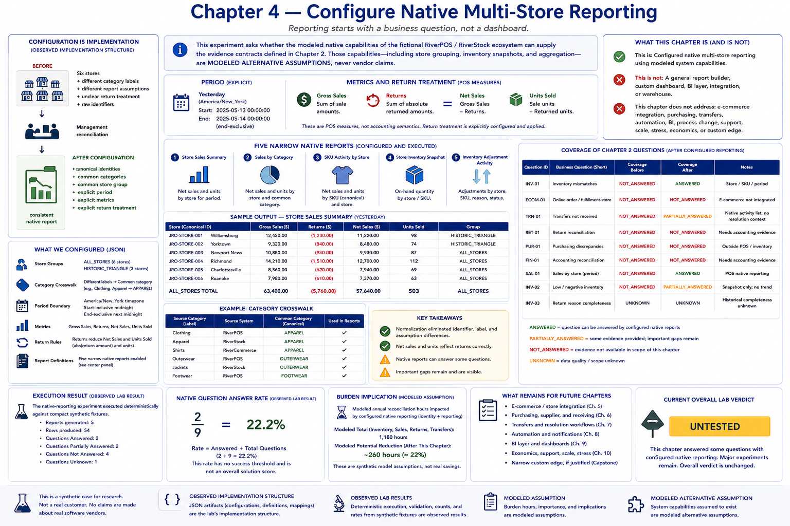

# Chapter 4 — Configure Native Multi-Store Reporting



Reporting starts with a business question, not a dashboard. This experiment asks whether the modeled native capabilities of the fictional RiverPOS/RiverStock ecosystem can supply the evidence contracts defined in Chapter 2. Those capabilities—including store grouping, inventory snapshots, and aggregation—are **MODELED ALTERNATIVE ASSUMPTIONS**, never vendor claims.

Run the deterministic experiment:

```bash
python -m retail_configuration_lab native-reporting
```

## Configuration is implementation

The JSON store groups, category crosswalk, period boundary, metrics, return rules, and report definitions are **OBSERVED IMPLEMENTATION STRUCTURE**. `ALL_STORES` contains the six canonical Chapter 3 stores; `HISTORIC_TRIANGLE` provides a smaller operational scope. Source labels such as `Clothing` and `Apparel` retain their provenance while both resolve to `APPAREL`.

```text
BEFORE

Six stores
+ different category labels
+ different report assumptions
+ unclear return treatment
+ raw identifiers

        ↓

Management reconciliation

AFTER CONFIGURATION

canonical identities
+ common categories
+ common store group
+ explicit period
+ explicit metrics
+ explicit return treatment

        ↓

consistent native report
```

“Yesterday” is incomplete until its boundary is defined. The lab uses `America/New_York`, a start-inclusive midnight, and an end-exclusive next midnight. It deliberately adds no further timezone machinery.

Gross sales sum sale amounts. Returns sum the absolute returned amounts. Net sales are `GROSS_SALES - RETURNS`, and units sold are sale units minus returned units. The fixture's return therefore changes net sales and units. A technically correct gross-only report could still mislead operations when return treatment is unstated. These are POS measures, not accounting semantics.

## Five narrow native reports

1. **Store Sales Summary** — store, gross, returns, net, and units.
2. **Sales by Category** — store and configured common category.
3. **SKU Activity by Store** — Chapter 3 canonical SKU, units, and net.
4. **Store Inventory Snapshot** — store/SKU on hand.
5. **Inventory Adjustment Activity** — adjustment, reason, and available status.

This is deliberately not a general report builder, custom dashboard, BI layer, integration, or warehouse.

## Coverage and residual gaps

The store-period sales question becomes **ANSWERED** after canonical identity, common scope, period, metrics, and returns are configured. Inventory-adjustment activity remains **PARTIALLY_ANSWERED**: native rows expose an adjustment, but cannot establish an agreed unusual threshold or prove resolution context. The historical completeness of return reasons remains **UNKNOWN**.

The return reconciliation question is **NOT_ANSWERED**, because accounting evidence is outside POS/inventory reporting. Channel sales also remain **NOT_ANSWERED**, because this chapter does not connect e-commerce. Purchasing, transfers, automation, BI, process change, support, scale, stress, economics, and the narrow custom edge remain future experiments. These visible gaps are evidence rather than failure.

The executable rows, coverage transitions, counts, and `native_question_answer_rate` are **OBSERVED LAB RESULT** values for compact synthetic fixtures. The rate has no success threshold and is not an overall solution score. Management importance and burden implications remain **MODELED ASSUMPTION**.

> The lab observed that configured synthetic native reporting could answer some defined business questions. It did not prove that a real retail product has these capabilities or that the broader operational problem is solved.

No custom reporting application was required for the observed normalization, but major experiments remain. The current overall lab verdict is **UNTESTED**. Chapter 5's e-commerce/store integration is intentionally not implemented here.
