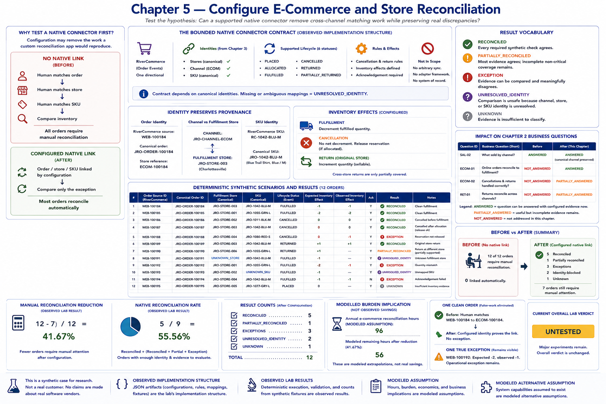

# Chapter 5 — Configure E-Commerce and Store Reconciliation



Chapter 4 established what configured native store reporting can answer. This chapter tests the next, narrower hypothesis: whether a **fictional supported native connector** can remove cross-channel matching work while preserving real discrepancies. A supported integration should be tested before custom software because configuration may remove the work that a custom reconciliation application would merely reproduce.

All RiverCommerce, RiverPOS, RiverStock, and RiverReturns capabilities in this chapter are **MODELED ALTERNATIVE ASSUMPTION**. Connector configuration, rules, mappings, and fixtures are **OBSERVED IMPLEMENTATION STRUCTURE**. Deterministic output counts are **OBSERVED LAB RESULT**. They say nothing about a real vendor.

```bash
python -m retail_configuration_lab ecommerce-reconciliation
```

## The bounded connector contract

`config/integrations/ecommerce_store_native.json` enables one directional order-event flow from RiverCommerce into the store/inventory ecosystem. It configures order-ID prefixes, the e-commerce channel, fulfillment locations, a required canonical SKU mapping, six supported statuses, cancellation and return rules, inventory effects, and required acknowledgement. It does not synchronize arbitrary records and is not an adapter framework.

The lifecycle is deliberately small: `PLACED`, `ALLOCATED`, `FULFILLED`, `CANCELLED`, `RETURNED`, and `PARTIALLY_RETURNED`. A fulfillment decrements fulfilled quantity; cancellation has no net decrement (including release after reservation); and a sellable return increments quantity. Cross-store returns are only partially covered.

## Order, channel, store, and SKU identity

An order retains all three useful references:

```text
RiverCommerce source: WEB-100184
Canonical order:       JRO-ORDER-100184
Store reference:       ECOM-100184
```

Canonicalization adds linkage; it does not overwrite provenance. Likewise, channel and fulfillment are independent dimensions:

```text
CHANNEL:           JRO-CHANNEL-ECOM
FULFILLMENT STORE: JRO-STORE-003
```

A physical store fulfilling an online order does not turn it into a physical-store sale. This distinction protects the Chapter 2 “what sold by channel?” question.

The connector depends on Chapter 3's canonical store, channel, and SKU identities. The active fixture includes an unmapped fulfillment source, while `data/ecommerce/invalid_fulfillment_mapping.json` preserves a deliberately invalid canonical-store mapping for negative validation. Missing or ambiguous mappings are `UNRESOLVED_IDENTITY`; the simulation never guesses a store from geography. Native integration does not eliminate identity governance.

## Deterministic scenarios and inventory effects

The compact fixture contains twelve inspectable orders: two ordinary fulfillments, a cancellation before fulfillment, a cancellation after allocation with release, a bad cancellation without release, an original-store return, a cross-store return, unknown store and SKU identities, an inventory quantity mismatch, an acknowledgement failure, and a placed order with insufficient evidence. It includes a clean end-to-end case as well as every residual category.

Cancellation before fulfillment expects no inventory movement. Cancellation after allocation expects the reservation to be released, also leaving no net decrement. An observed decrement or missing release is an `EXCEPTION`.

An original-store online return links to the order and increments sellable inventory. The fictional connector does not fully cover a return accepted at a different physical store, so that evidence remains `PARTIALLY_RECONCILED`. This is a bounded Chapter 5 test, not the broader returns-and-transfers experiment reserved for a later chapter.

## Before and after

```text
NO NATIVE LINK
        ↓
HUMAN MATCHES ORDER
        ↓
HUMAN MATCHES STORE
        ↓
HUMAN MATCHES SKU
        ↓
COMPARE INVENTORY

versus:

CONFIGURED NATIVE LINK
        ↓
ORDER / STORE / SKU LINKED
        ↓
COMPARE ONLY THE EXCEPTION
```

Before configuration, all 12 orders require manual reconciliation and direct linkage is absent. After configuration, 10 link automatically: 5 reconcile, 1 is partial, 3 are exceptions, 2 are identity-blocked, and 1 is unknown. Seven still require manual attention. Thus the observed synthetic manual-reconciliation reduction ratio is `(12 - 7) / 12 = 41.67%`.

The native reconciliation rate is `5 / 9 = 55.56%`: reconciled orders divided by orders with enough identity and evidence to evaluate (`RECONCILED`, `PARTIALLY_RECONCILED`, or `EXCEPTION`). Neither metric has a success threshold and neither is labor savings.

One clean order illustrates false-work elimination: before the connector a human would match `WEB-100184` to `ECOM-100184`; afterward configured identity proves the link and no exception remains. Conversely, `WEB-100192` links correctly but expects a decrement of two and observes one. That true operational exception remains visible.

## Result vocabulary and residuals

- `RECONCILED` — every required synthetic check agrees.
- `PARTIALLY_RECONCILED` — most evidence agrees, but incomplete non-critical coverage remains.
- `EXCEPTION` — evidence can be compared and meaningfully disagrees.
- `UNRESOLVED_IDENTITY` — comparison is unsafe because channel, store, or SKU identity is unresolved.
- `UNKNOWN` — evidence is insufficient to classify.

`RECONCILED` is a technical synthetic result, not “commercially solved.” The output intentionally exposes unknown identities, unsupported cross-store return behavior, failed acknowledgement, a cancellation reversal failure, a quantity mismatch, and missing evidence.

## Chapter 2 question impact

- `SAL-02` remains `ANSWERED`: the canonical online channel remains distinct from its fulfillment store, so Chapter 4 does not regress.
- `ECOM-01` becomes `ANSWERED`: configured evidence identifies orders that do and do not reconcile to expected fulfillment.
- `ECOM-02` is `PARTIALLY_ANSWERED`: cancellation evidence is useful, while cross-store return coverage is incomplete.
- `RET-01` remains `PARTIALLY_ANSWERED`: online order/inventory evidence improves, but accounting and broader return evidence remain outside this chapter.

## Burden implication, not observed savings

The CLI presents 96 annual e-commerce reconciliation hours only as a **MODELED ASSUMPTION**. Applying the observed synthetic reduction ratio yields 56 modeled remaining hours as a **MODELED EXTRAPOLATION**. Neither number is measured retailer effort, cost, or savings.

## What this experiment does not prove

> The lab observed that a fictional supported native integration reduced synthetic manual reconciliation. It did not establish that a real commercial integration has the same capabilities, reliability, or economics.

The experiment does not prove production reliability, operational adoption, support quality, scaling, security, accounting completeness, or real labor reduction. Purchasing/inventory configuration, broader returns/transfers, automation, BI, process change, residual burden, support surface, fragmentation stress, a narrow custom edge, a full-custom counterfactual, and economics remain untested. The overall verdict therefore remains **UNTESTED**.
