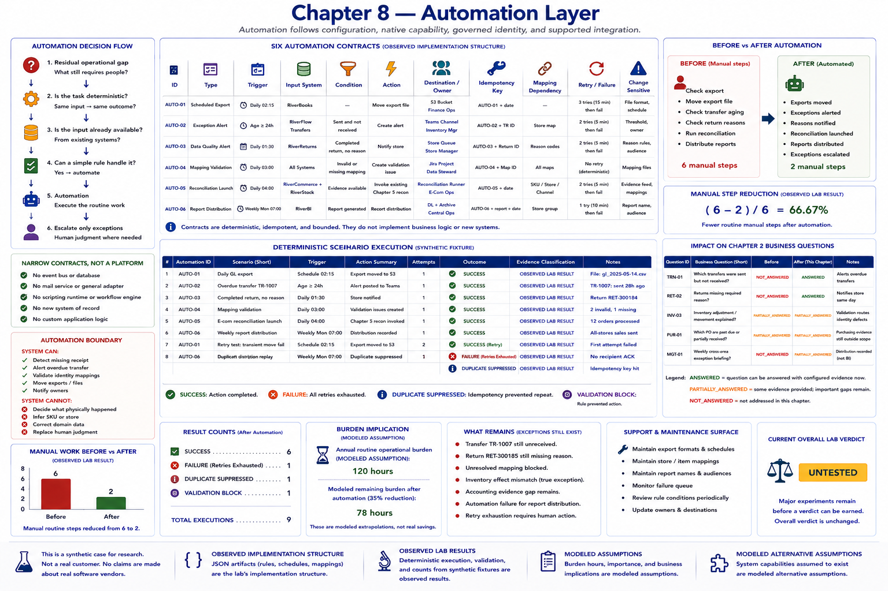

# Chapter 8 — Automation Layer



Automation follows configuration, native capability, governed identity, and supported integration. RiverFlow is fictional; its schedule, alert, validation, distribution, and reconciliation-launch capabilities are **MODELED ALTERNATIVE ASSUMPTION**. The six narrow contracts in `config/automation/automations.json` are **OBSERVED IMPLEMENTATION STRUCTURE**. Only deterministic execution outcomes are **OBSERVED LAB RESULT**.

```text
RESIDUAL OPERATIONAL GAP
        ↓
IS THE TASK DETERMINISTIC?
        ↓
IS THE INPUT ALREADY AVAILABLE?
        ↓
CAN A SIMPLE RULE HANDLE IT?
        ↓
AUTOMATION
        ↓
ESCALATE ONLY EXCEPTIONS
```

## Narrow contracts, not a workflow engine

Each enabled contract names its type, deterministic trigger, input system, condition, action, destination, owner, retry/failure behavior, idempotency, mapping dependency, and change sensitivity. The small trigger vocabulary covers schedules, available records, age thresholds, and validation failures. The equally small action vocabulary moves an export, creates an alert, validates mappings, invokes existing reconciliation, or records report distribution. There is no event bus, database, mail service, general adapter, scripting runtime, or new system of record.

Domain-heavy correction remains outside automation. A rule can detect a missing receipt; it cannot decide what physically happened. A rule can reject ambiguous identity; it must not guess the SKU.

## Deterministic experiment

Run:

```bash
python -m retail_configuration_lab automation
```

The scenarios move a scheduled RiverBooks export, alert on overdue transfer `JRO-TR-1007`, notify the store about a completed return with no reason, validate identity, launch the existing Chapter 5 reconciliation, and record distribution of the Chapter 4 native report. A synthetic transient movement failure succeeds on retry. A separate report action exhausts three attempts. Execution records preserve trigger reference, attempts, action summary, failure reason, and evidence classification.

The idempotency key is conceptually `automation_id + source_record_id + trigger_version`. Replaying the missing-transfer trigger therefore suppresses a second alert. This is a safety rule, not integration infrastructure.

## Before and after

```text
BEFORE

human checks export
human moves file
human checks transfer
human checks return reason
human runs reconciliation
human distributes report

        ↓

AFTER AUTOMATION

routine trigger
        ↓
routine action

exception
        ↓
human attention
```

The fixture counts six recurring manual steps before automation and two residual intervention steps afterward, a 66.67% synthetic manual-step reduction. This is observed fixture behavior, not observed labor or dollar savings. Export movement, exception checking, manual reconciliation launch, mapping review, and report distribution burden remain **MODELED ASSUMPTION** categories.

> The lab observed that configured synthetic automation removed some recurring manual steps and surfaced exceptions faster. It did not prove that the underlying operational exceptions disappeared.

The transfer is still unreceived after its alert. The return still lacks a reason after notification. The unresolved mapping remains blocked. True quantity mismatch, accounting evidence gap, automation failure, and retry exhaustion remain visible for later analysis.

> Good automation should reduce the amount of routine work a person performs, not hide the amount of exceptional work that still requires judgment.

## Failure visibility and support surface

Retries are bounded and deterministic. Outcomes distinguish success, failure, retry exhaustion, validation block, and duplicate suppression. Owners must maintain export formats, store and item mappings, report names, audiences, and schedules. These fields make obligations visible without performing the later formal support analysis.

## Chapter 2 impact

Automation improves timeliness for `TRN-01` and `RET-02` without inventing evidence. `INV-03`, `PUR-01`, and `MGT-01` remain only partially answered: validation can route identity defects, while purchasing evidence and a governed cross-area briefing remain incomplete. Alerting never upgrades absent evidence into an answer.

## Boundary and remaining work

Chapter 8 does not implement BI, dashboards, process redesign, an inventory service, or custom application logic. Missing transfer receipt, missing return reason, unresolved mapping, true quantity mismatch, accounting evidence gap, automation failure, and retry exhaustion remain inputs to later BI, process, burden, and support experiments.

```text
CONFIGURE
        ↓
NATIVE INTEGRATE
        ↓
AUTOMATE NARROW ROUTINE GAPS
        ↓
SURFACE EXCEPTIONS
        ↓
DO NOT BUILD CUSTOM SOFTWARE YET
```

**Current lab verdict: UNTESTED**

BI/reporting configuration, process change, formal residual burden, support, scaling and fragmentation, native-coverage sensitivity, custom alternatives, economics, and the capstone remain untested.
