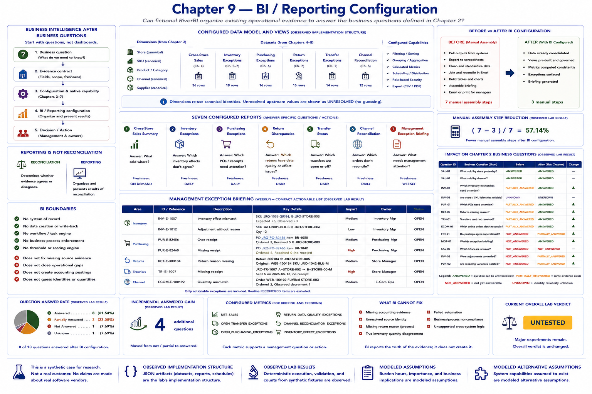

# Chapter 9 — BI / Reporting Configuration



Business intelligence comes after business questions: otherwise a team can produce a large dashboard without knowing which decision it supports. Chapter 2 supplies the evidence contracts and freshness requirements. This experiment asks whether fictional **RiverBI** can organize evidence already produced by Chapters 4–8. RiverBI's configured dataset, filtering, grouping, and scheduling capability is a **MODELED ALTERNATIVE ASSUMPTION**; the JSON configuration is **OBSERVED IMPLEMENTATION STRUCTURE**; deterministic rows and coverage transitions are **OBSERVED LAB RESULT**.

```bash
python -m retail_configuration_lab bi-reporting
```

## The bounded reporting model

The configured model contains six datasets: cross-store sales, inventory exceptions, purchasing exceptions, return exceptions, transfer exceptions, and channel reconciliation. It reuses canonical store, SKU, product/category, channel, and supplier dimensions from Chapter 3. It does not recreate mappings. An unresolved upstream SKU is displayed as `UNRESOLVED`; RiverBI does not guess.

The cross-store sales view projects Chapter 4's native store sales evidence, including gross sales, returns, net sales, and units. Inventory exception rows are deliberately not a perpetual ledger or an authoritative stock balance. They identify known expected/observed effect disagreements from channel and movement evidence. Purchasing rows project Chapter 6's PO, supplier, destination, quantity, result, and external-accounting-evidence flag. Return and transfer views project Chapter 7 outcomes unchanged. Channel rows project Chapter 5 order reconciliation, fulfillment, identity, status, and unresolved issues.

Seven compact reports expose those six subjects: cross-store sales summary, inventory exceptions, purchasing exceptions, return discrepancies, transfer status, channel reconciliation, and a central management exception briefing. The configured metrics are `NET_SALES`, `OPEN_TRANSFER_EXCEPTIONS`, `OPEN_PURCHASING_EXCEPTIONS`, `RETURN_DATA_QUALITY_EXCEPTIONS`, `CHANNEL_RECONCILIATION_EXCEPTIONS`, and `INVENTORY_EFFECT_EXCEPTIONS`. Each supports a question or action; there is no invented health score.

## Freshness and a small briefing

Freshness follows the question rather than an assumption that faster is better. Sales is on demand, operational exception reports are daily, and the management briefing is weekly. More frequent reporting is not automatically more valuable.

The briefing includes only actionable inventory, purchasing, return, transfer, and e-commerce rows. Routine `RECONCILED` transfers and returns are excluded. It remains a compact textual exception list, not a web dashboard or workflow engine.

## Reporting is not reconciliation

```text
RECONCILIATION
  determines whether evidence agrees

REPORTING
  organizes and presents reconciliation results
```

Chapters 5–7 own the reconciliation outcomes. Chapter 9 projects and filters them without write-back. Thus a perfectly displayed `JRO-TR-1007 MISSING_RECEIPT` remains a missing receipt.

```text
BEFORE BI

native sales report
+
purchasing exception output
+
transfer reconciliation output
+
return exception output
+
e-commerce reconciliation output
        ↓
human assembles management picture

AFTER BI CONFIGURATION

existing evidence
        ↓
configured views
        ↓
exception briefing
```

```text
BETTER VISIBILITY ≠ BETTER SOURCE DATA
VISIBLE EXCEPTION ≠ RESOLVED EXCEPTION
```

## Coverage and manual assembly experiment

Thirteen BI-relevant Chapter 2 questions are evaluated. Before BI, 4 are answered, 5 partial, 3 not answered, and 1 unknown. After BI, 8 are answered, 3 partial, 1 not answered, and 1 unknown. Purchasing attention, receiving discrepancies, fulfillment exceptions, and the management briefing become answerable because evidence that already existed is presented coherently. The answer rate is 8/13 (61.54%), and incremental answered-question gain is 4. `FIN-01` improves only to partial because operational exceptions exist but complete accounting evidence does not. `SAL-03` remains not answered because agreed thresholds do not exist, and `INV-03` remains unknown.

The modeled before workflow has seven report-assembly steps; after configuration it has three. The deterministic modeled step-reduction ratio is 4/7 (57.14%). This concerns consolidation, spreadsheet assembly, and briefing presentation only. Investigation labor, business importance, and any dollar impact remain **MODELED ASSUMPTION**, not observed savings.

## What BI cannot fix

Residual inputs for later experiments are missing accounting evidence, unresolved source identity, missing return reason, true inventory quantity disagreement, failed automation, business/process noncompliance, and unsupported cross-system logic. BI neither repairs these sources nor enforces receiving, return-reason, transfer-closing, or mapping processes. No Chapter 10 process change is implemented here.

> The lab observed that configured synthetic BI consolidated existing evidence and answered additional management questions. It did not create missing operational evidence or resolve the underlying exceptions it displayed.

The result means configured reporting organized existing synthetic evidence into useful management views—not that operational problems were eliminated.

**Current lab verdict: UNTESTED**
