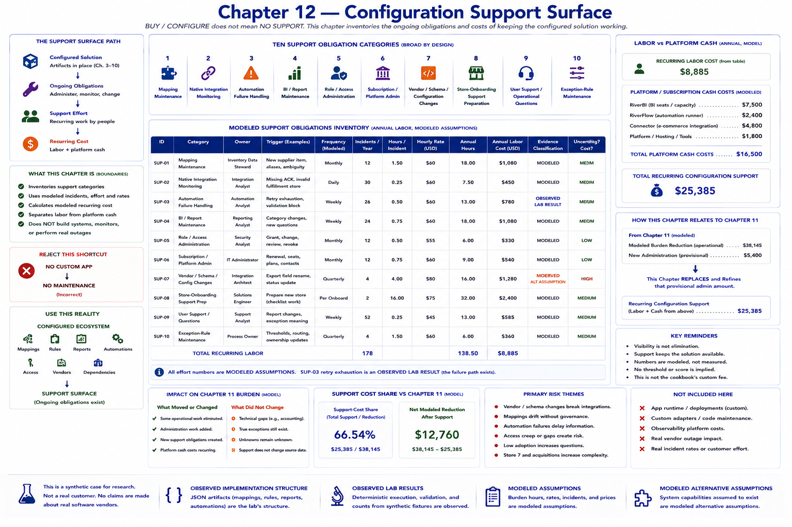

# Chapter 12 — Configuration Support Surface



`BUY / CONFIGURE` does not mean `NO SUPPORT`. Chapter 11 measured what remains; this chapter inventories what the configured ecosystem costs to keep working after go-live. **Implementation cost** creates the configuration once. **Ongoing support cost** administers, monitors, and changes it. This model charges only the latter.

```text
CONFIGURED SOLUTION
        ↓
ONGOING OBLIGATIONS
        ↓
ADMINISTRATION · MAPPINGS · AUTOMATION FAILURES · ACCESS
REPORTS · VENDOR/SCHEMA CHANGES · ONBOARDING PREPARATION · USER SUPPORT
        ↓
RECURRING SUPPORT EFFORT
        ↓
RECURRING COST
```

Run the deterministic analysis:

```bash
python -m retail_configuration_lab support-surface
```

## The bounded inventory

Ten deliberately broad categories prevent a false sense of precision:

1. **Mapping maintenance** covers new supplier items, aliases, ambiguity, and future store identifiers. Mappings are observed structure; incident frequency and handling time are modeled.
2. **Native integration monitoring** covers missing batch acknowledgements, invalid fulfillment-store mappings, and status changes. It does not simulate a vendor outage.
3. **Automation failure handling** covers Chapter 8 retry exhaustion, validation blocks, and rule/configuration changes. The failure path is an observed lab result, while annual labor is assumed.
4. **BI/report maintenance** covers categories, definitions, questions, filters, and store groups without redesigning Chapter 9.
5. **Role/access administration** covers grants, changes, reviews, and revocation. No authentication system is built.
6. **Subscription/platform administration** covers fictional renewal, seat, plan, and vendor-contact work.
7. **Vendor/schema/configuration changes** uses a bounded fictional renamed-export-field scenario. It makes no claim about a real vendor.
8. **Store-onboarding support preparation** preserves a checklist for identity, roles, groups, mappings, reports, connector configuration, and automation inclusion. It does **not** add or onboard Store #7.
9. **User support / operational questions** bounds questions about report changes and exception interpretation; it does not price every ordinary question.
10. **Exception-rule maintenance** covers thresholds, ownership, and routing.

Each obligation has an owner, trigger, explicit frequency label and incident count, hours per incident, hourly rate, calculated annual hours and labor cost, source dependency, evidence classification, uncertainty, pre-configuration flag, and descriptive risk. `LOW`, `MEDIUM`, `HIGH`, and `UNKNOWN` communicate rationale only; there is no weighted score.

## Structure is evidence of a surface—not its effort

Mappings, reports, automations, native configuration, retry paths, and rules are **OBSERVED IMPLEMENTATION STRUCTURE**. Synthetic retry exhaustion is an **OBSERVED LAB RESULT**. The fictional export rename and recurring platform fees are **MODELED ALTERNATIVE ASSUMPTION**. Incident volumes, hours, and labor rates are **MODELED ASSUMPTION**.

> The repository demonstrates the existence of a recurring support surface. The modeled support hours, labor rates, incident frequencies, and platform costs are assumptions, not observed customer support data.

## Work moved into administration

```text
ORIGINAL MANUAL BURDEN
        ↓
CONFIGURATION-FIRST SOLUTION
        ↓
LESS ROUTINE OPERATIONAL WORK
        +
NEW ADMINISTRATION
        +
NEW SUPPORT
        ↓
NET VALUE MUST ACCOUNT FOR BOTH
```

For example, governed mapping removes routine manual SKU reconciliation but creates mapping administration. The removed work and its replacement cannot both be charged as fully current work.

Chapter 11's `$5,400.00` new-administration burden is explicitly provisional. Chapter 12 **replaces and refines it** with its obligation-level labor model; it is not added again. Residual operational burden remains separate, eliminated original burden is not revived, each obligation ID enters the labor sum once, and platform cash costs enter a separate sum. Validation rejects a model that does not declare this replacement, as well as duplicates, negatives, bad classifications, unresolved dependencies, and calculation mismatches.

## Labor, cash, and interpretation

For every obligation:

```text
annual effort = incidents/year × hours/incident
annual labor cost = annual effort × hourly cost
```

The model then keeps fictional BI, automation, connector, and license cash costs separate before adding labor and cash into total recurring configuration support. None is the cookbook's `$15,000.00` custom annual fee, and none is real-vendor pricing.

Two educational metrics put the model beside Chapter 11:

```text
support-cost share = total recurring configuration support / Chapter 11 modeled burden reduction
net modeled burden reduction after support = Chapter 11 modeled burden reduction - total recurring configuration support
```

Zero reduction produces no share rather than division by zero. There is no success threshold. These are not complete deal economics: setup cost, Store #7, acquired-store fragmentation, suite strengths and weaknesses, a narrow custom edge, the full-custom counterfactual, and complete economics remain untested.

Support failures affect **availability**, not Chapter 2 evidence or coverage classification. “Which transfers are unresolved?” can remain answered while an automation/report failure risks delayed delivery.

## What configuration replaces—and what it creates

Reject this shortcut:

```text
NO CUSTOM APP
        ↓
NO MAINTENANCE
```

Use the real support surface:

```text
CONFIGURED ECOSYSTEM
        ↓
MAPPINGS
RULES
REPORTS
AUTOMATIONS
ACCESS
VENDOR DEPENDENCIES
        ↓
SUPPORT SURFACE
```

A full custom solution would likely add application runtime, deployments, custom adapters, observability, application defects, and dependency upgrades. This chapter preserves that conceptual comparison but deliberately does not calculate it.

The repository proves that configured artifacts and synthetic failure paths exist and validates exact arithmetic. It does not prove real incident rates, employee effort, labor prices, platform prices, vendor behavior, production availability, or that `BUY / CONFIGURE` wins. The current lab verdict remains **UNTESTED**. The next question—not executed here—is whether the configuration scales cleanly to Store #7.
