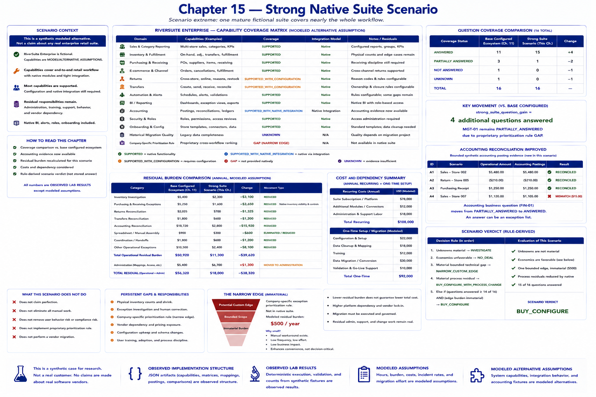

# Chapter 15 — Strong Native Suite Scenario



Scenario extremes are useful because they challenge a recommendation at its strongest boundary. Chapter 14 weakened reuse through fragmentation; this chapter asks the opposite question: if one mature fictional suite covers nearly the whole workflow, does an economically meaningful custom problem remain?

> This is a synthetic modeled alternative, not a claim about any real enterprise retail suite.

Run the deterministic experiment:

```bash
python -m retail_configuration_lab strong-native-suite
```

## Strong coverage is still configured coverage

**RiverSuite Enterprise** is fictional. Its capability records are **MODELED ALTERNATIVE ASSUMPTION**. They cover multi-store sales and category reporting; store inventory, adjustments, ownership, transfers, and fulfillment effects; purchase orders, suppliers, supplier-item mappings, receiving and discrepancies; e-commerce identity, cancellation, fulfillment, cross-channel returns and inventory synchronization; native BI; alerting and scheduled reporting; accounting postings; roles; and onboarding.

Most capabilities are `SUPPORTED`, `SUPPORTED_WITH_CONFIGURATION`, or `SUPPORTED_WITH_NATIVE_INTEGRATION`. That does not mean perfection. Historical migration quality remains `UNKNOWN`, and the company-specific exception-prioritization rule remains a `GAP`. Configuration maintenance, access administration, training, user behavior, unusual cases, support, and vendor dependency remain real responsibilities.

```text
STRONGER NATIVE COVERAGE
        ↓
FEWER CUSTOM GAPS
        ↓
LESS INTEGRATION OWNERSHIP
```

## Accounting reconciliation improves

Chapter 11 lacked accounting-side evidence. This scenario adds a bounded fixture—not an accounting engine—with sales, return, and purchasing operational amounts paired to native accounting postings. Three postings reconcile exactly and one sales mismatch remains visible. Thus the accounting business question moves from `PARTIALLY_ANSWERED` to `ANSWERED`: an answer can be an exception list, not an assertion that every record agrees.

The matrix, posting fixtures, and comparison records are **OBSERVED IMPLEMENTATION STRUCTURE**. Exact reconciliation, question counts, burden arithmetic, and the rule-derived scenario verdict are **OBSERVED LAB RESULT**.

## Questions and residual burden

The base configured ecosystem answers 11 of the 16 existing Chapter 2 questions in this scenario comparison. The strong suite answers 15, a `strong_suite_question_gain` of four. `MGT-01` remains partial because the proprietary prioritization rule is absent.

The unchanged Chapter 11 base calculation retains $50,920 of residual operational burden and $5,400 of administration. Scenario category assumptions reduce operational residual to $11,300, so `strong_suite_residual_burden_reduction` is $39,620. Physical inventory investigation, human correction, and exceptional records do not disappear. Some work is eliminated or reduced; some moves to administration or becomes a support obligation.

## Cost and dependency tension

Recurring figures remain separate:

- fictional subscription/platform: $78,000;
- connector/modules: $12,000;
- administration/support labor: $18,000.

The one-time $92,000 setup/migration assumption comprises $22,000 configuration, $18,000 data cleanup, $12,000 training, $30,000 migration, and $10,000 validation. These dollars and burden allocations are **MODELED ASSUMPTION**; fictional native behavior is a **MODELED ALTERNATIVE ASSUMPTION**.

```text
STRONGER NATIVE COVERAGE
        ↓
HIGHER PLATFORM DEPENDENCY
HIGHER CASH COST
MIGRATION / ADMINISTRATION
```

Lower burden therefore does not automatically mean lower total cost. The solutions-engineering question is:

> Is the reduction in residual burden worth the additional configured-product cost and dependency?

## The remaining edge and the hypothesis

A manager can sort the native exception view weekly, but the suite does not encode James River Outfitters' proprietary cross-workflow prioritization rule. Its modeled burden is only $500 and its materiality is explicitly false. Building software for it now would duplicate a broad supported suite to solve a narrow convenience.

Transparent ordered rules produce the scenario verdict. Material unknowns lead to `INVESTIGATE`; explicitly unfavorable economics lead to `NO_DEAL`; a material bounded technical gap leads to `NARROW_CUSTOM_EDGE`; a material process residual leads to `BUY_CONFIGURE_WITH_PROCESS_CHANGE`; otherwise nearly complete question coverage plus an immaterial edge leads to `BUY_CONFIGURE`. This is derived rather than stored as the answer.

The result strengthens the original BUY / CONFIGURE hypothesis and demonstrates that custom need can shrink without pretending it vanishes. It does **not** settle the project: **Overall lab verdict: UNTESTED**. Chapter 16—not implemented here—must test weak native coverage.
