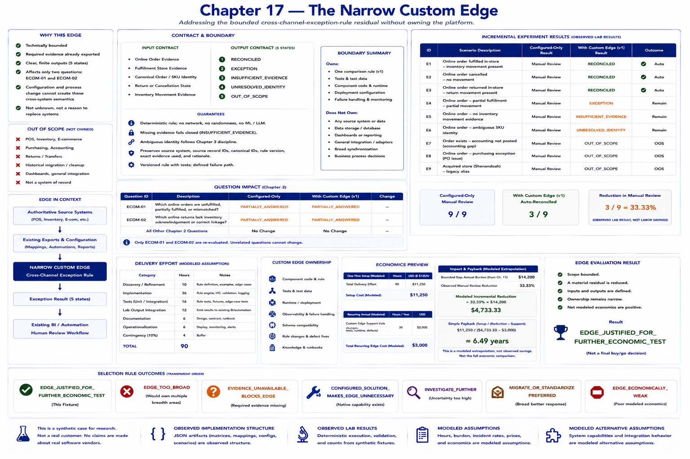

# Chapter 17 — The Narrow Custom Edge



Custom code appears only after configuration, native integration, automation, BI, and process change have been tested. It does not revisit the original, broad retail problem. It addresses Chapter 16's **bounded** `cross-channel-exception-rule`: exported order and fulfillment evidence exists, but one James River-specific inventory-effect rule still requires review.

```text
ORIGINAL PROBLEM
        ↓
CONFIGURE · NATIVE INTEGRATE · AUTOMATE · BI · PROCESS CHANGE
        ↓
MOST PROBLEM REMOVED
        ↓
BOUNDED TECHNICAL RESIDUAL
        ↓
SMALLEST CUSTOM EDGE
        ↓
EXISTING ECOSYSTEM REMAINS AUTHORITATIVE
```

The question is proportionality: **does roughly 10–20% unresolved functionality justify roughly 10–20% custom ownership?** Those figures are a principle, not a claim that this fixture measures either percentage exactly.

## Selection and justification

The candidate is technically bounded; its order, store, SKU, cancellation/return, and movement inputs are already exported; its five possible outputs are defined; and its affected questions are `ECOM-01` and `ECOM-02`. Chapter 16 already tested configuration and its export → mapping → automation → BI → manual-review chain. Earlier process experiments cannot manufacture missing cross-system semantics. The gap is neither unknown nor a reason to replace multiple systems. A definition that fails these checks is rejected rather than executed.

## Contract and boundary

The input contract is online-order evidence, fulfillment-store evidence, canonical order/SKU identity, return or cancellation state, and inventory movement evidence. The output contract is `RECONCILED`, `EXCEPTION`, `INSUFFICIENT_EVIDENCE`, `UNRESOLVED_IDENTITY`, or `OUT_OF_SCOPE`.

The component owns one versioned comparison rule, its tests, its assumed runtime/deployment, and its failure path. It does **not** own POS, inventory, purchasing, accounting, e-commerce, returns/transfers, historical migration, dashboards, or general integration. Those systems remain authoritative. The edge consumes existing exports and emits exception evidence to existing BI, automation, and human workflow; it is not a new system of record.

Each result preserves source systems, source record IDs, canonical IDs, the rule version, the exact input evidence used, and a rationale. The rule is deterministic and has no network, random, API, model, or LLM behavior. Missing evidence fails closed. Ambiguous identity follows Chapter 3 discipline. Accounting gaps, purchasing exceptions, and broad acquired-store history explicitly receive `OUT_OF_SCOPE`: the component can say, “This is not my problem.”

## Incremental experiment

**The custom component is being evaluated against the best configured alternative, not against doing nothing.**

The configured-only baseline sends all nine fixture records to manual review. With the edge, three supported records reconcile automatically. A real disagreement remains `EXCEPTION`; missing evidence remains `INSUFFICIENT_EVIDENCE`; ambiguous identity remains unresolved; and accounting, purchasing, and acquired-store cases stay outside scope. Six records still require review, so the observed synthetic manual-review reduction is 3/9, or 33.33%. This ratio is not observed labor savings.

Only `ECOM-01` and `ECOM-02` are re-evaluated. Unrelated Chapter 2 statuses cannot change. The workaround remains export → mapping → narrow rule → existing BI/automation → residual manual review. Configuration remains useful; only the unsupported manual-rule layer is reduced.

## Ownership, effort, support, and economics preview

Configured-only ownership covers mappings, reports, automations, and configuration—not the POS, inventory, or e-commerce runtimes. The narrow edge adds one component, tests, a deployment/runtime assumption, and a failure path. It does not add a database, dashboard, integration bus, workflow engine, or broad synchronization.

Delivery categories are discovery/refinement, implementation, tests, lab-output integration, documentation, operationalization, and contingency. Their fixture total is 90 hours versus Chapter 0's 378-hour full-custom assumption. At the modeled $125/hour rate, setup is $11,250. Recurring custom-code support—rule changes, test maintenance, schema compatibility, runtime ownership, and defect investigation—is modeled as 30 hours and $3,000 annually.

Applying the observed synthetic 33.33% reduction ratio to the bounded gap's modeled $14,200 annual burden produces a **modeled extrapolation**, not observed savings: $4,733.33 modeled incremental reduction. The narrow preview divides setup by incremental reduction less support only when that denominator is positive. This fixture's simple modeled payback is about 6.49 years. This is not the full economic comparison or a deal conclusion.

The transparent fixture result is `EDGE_JUSTIFIED_FOR_FURTHER_ECONOMIC_TEST`: scope is bounded, a material residual is reduced, and added ownership remains narrow. A broad rule would be `EDGE_TOO_BROAD`; unavailable required evidence would block the edge; a configured solution would make it unnecessary; and weak net economics can classify a technically useful edge as economically weak.

```bash
python -m retail_configuration_lab custom-edge
```

The lab observes the behavior and ownership structure of the synthetic custom edge. Delivery hours, support hours, and dollar economics remain modeled assumptions.

The critical difference from a platform is restraint: authoritative existing systems → existing exports/configuration → small custom edge → exception result → existing BI/automation/human workflow. Chapter 18 is intentionally not implemented; comparison with the full-custom counterfactual comes next.

**Overall lab verdict: UNTESTED.**
