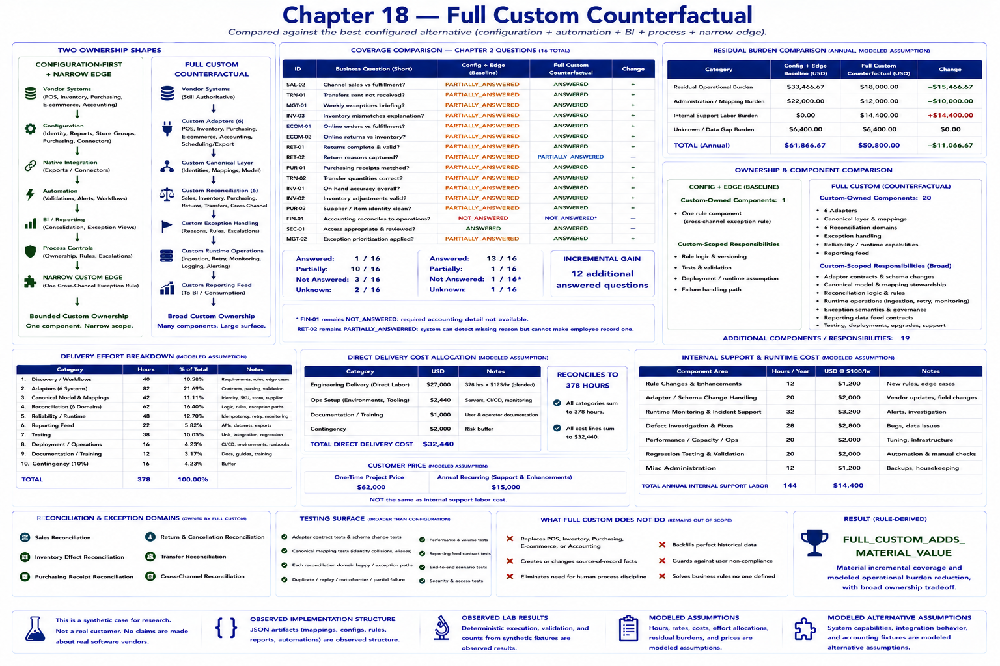

# Chapter 18 — Full Custom Counterfactual



Full custom must be compared with the **best configured alternative**, not with doing nothing. Chapters 3–17 have already established identity configuration, native reporting and connectors, purchasing and return/transfer rules, automation, BI, process controls, and one narrow edge. This chapter asks what broader ownership buys *after* those mechanisms have removed much of the problem.

> The full-custom architecture is a modeled counterfactual. The repository does not implement the entire system, and the 378 engineering hours remain a modeled assumption from the original case.

Run the deterministic comparison:

```bash
python -m retail_configuration_lab full-custom-counterfactual
```

## Two ownership shapes

```text
CONFIGURATION-FIRST + NARROW EDGE       FULL CUSTOM
vendor systems                          vendor systems
      ↓                                       ↓
configuration                           custom adapters
native integration                            ↓
automation                              custom canonical layer
BI                                            ↓
process                                custom reconciliation
      ↓                                       ↓
small custom edge                       custom exception handling
      ↓                                       ↓
bounded custom ownership                custom runtime operations
                                              ↓
                                        custom reporting feed
                                              ↓
                                        broad custom ownership
```

The configured path depends more on vendors but owns less runtime. Its identity, store-group, purchasing, reporting, connector, automation, BI, and process structures are observed implementation structures in this lab. The edge owns one company-specific reconciliation rule, its tests, deployment assumption, and failure path.

The counterfactual owns six adapters (POS, inventory, purchasing, e-commerce, accounting, and scheduling/export); their contracts, validation, transformations, provenance, and vendor-change response; canonical store, SKU/product/variant, supplier, channel, order, PO, and transfer mappings; and six reconciliation domains. It also owns exception semantics for unresolved identity, missing records, quantity/state mismatches, unsupported scenarios, and validation failures.

## Reliable operation is part of the product

Custom business logic alone is insufficient. Scheduled ingestion requires idempotency, acknowledgements, bounded retry, replay, logging, monitoring, and alerting. Reconciliation must retain source provenance and fail closed. Deployments, dependency upgrades, integration regression tests, vendor changes, and support escalation remain provider obligations. The source systems nevertheless remain authoritative: POS for sales, inventory for inventory, purchasing for POs, e-commerce for online orders, and accounting for accounting. The custom layer is not an ERP.

The testing surface includes adapter contracts and schema changes, canonical mappings, each reconciliation and exception branch, duplicate/replay behavior, partial failures, reporting contracts, and James River rules. A reusable runtime core can coexist with customer-configured mappings and customer-specific return, transfer, acquired-store, exception, and management-briefing semantics.

## Coverage and residual burden

The deterministic fixture moves from **1 answered question** under the Chapter 17 weak-native configuration-plus-edge baseline to **13 answered questions** under full custom: an incremental gain of **12**. That gain is modeled, not observed production value. `FIN-01` remains not answered because the required accounting detail is unavailable. `RET-02` remains partial because software can detect a missing return reason but cannot make an employee record one. A physical transfer that was never received likewise remains a process/physical exception rather than synthetic receipt evidence.

Modeled residual operational burden changes from **$33,466.67** to **$18,000.00**, a **$15,466.67** reduction. Administration changes from $22,000 to $12,000, while the counterfactual introduces 144 modeled internal support hours costing $14,400 at the explicit $100/hour assumption. Unknown burden remains $6,400. These are scenario inputs for Chapter 19, not a final option ranking.

## Delivery and ownership comparison

The original 378 modeled hours reconcile exactly as follows: discovery/workflows 40; adapters 82; canonical mappings 42; reconciliation 62; reliability/runtime 48; reporting 22; testing 38; deployment/operations 16; documentation/training 12; contingency 16. The direct-delivery allocation also reconciles exactly to **$32,440**: engineering delivery $27,000; operations setup $2,440; documentation/training $1,000; contingency $2,000. Customer price remains $62,000 and annual recurring cash price remains $15,000; neither is the modeled internal support cost.

Configuration plus edge owns one custom-code component. Full custom models 20 custom components, including six adapters and eight explicitly required reliability capabilities. The chapter result is `FULL_CUSTOM_ADDS_MATERIAL_VALUE`: the fixture shows material incremental coverage and modeled operational-burden reduction, together with broad adapter, reconciliation, runtime, testing, and support ownership. This is a transparent technical result, not the final economic verdict.

## Core lesson

```text
MORE CUSTOM SOFTWARE
        ≠
PROPORTIONALLY MORE VALUE
```

The correct question is: **What incremental value does broader ownership buy after configuration has already removed most of the problem?** Here the answer is twelve more modeled answered questions and $15,466.67 less modeled residual operational burden, purchased with nineteen additional custom-owned conceptual components/responsibilities and a much larger runtime surface. Neither architecture is universally better.

The full-custom structure is a **MODELED ALTERNATIVE ASSUMPTION**; its effort, cost allocation, support, and residual burden are **MODELED ASSUMPTIONS**. The Chapter 17 baseline structures are **OBSERVED IMPLEMENTATION STRUCTURE**. Deterministic coverage, ownership counts, arithmetic, and the rule-derived result are **OBSERVED LAB RESULTS** of the model.

**Overall lab verdict: UNTESTED.** Chapter 19—not this chapter—will compare do nothing, buy/configure, configure plus automation, configure plus the narrow edge, and full custom using complete economics and risk.
